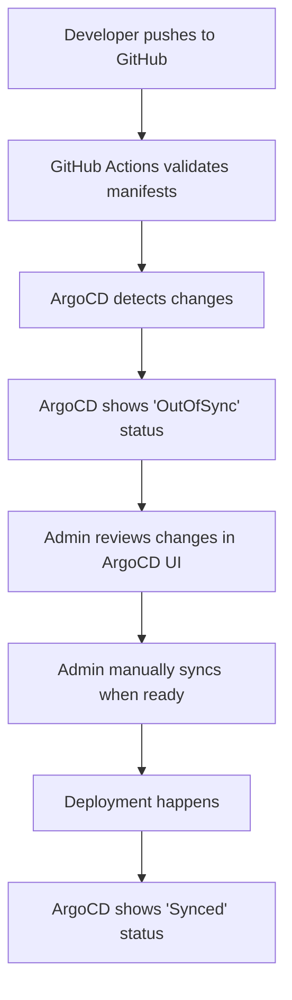

# Manual Sync Workflow with ArgoCD

This document explains the manual sync workflow that gives you full control over when deployments happen.

## 🎯 **Workflow Overview**



## 🔧 **How It Works**

### 1. **Push to GitHub**
- You push changes to the `main` branch
- GitHub Actions validates all YAML manifests
- Validation report is generated

### 2. **ArgoCD Detection**
- ArgoCD polls GitHub every 3 minutes (default)
- Detects changes and marks applications as "OutOfSync"
- Shows diff between current and desired state

### 3. **Manual Review**
- You review changes in ArgoCD UI
- Check the diff to see what will change
- No sync window restrictions - deploy anytime

### 4. **Manual Sync**
- Click "Sync" button in ArgoCD UI
- Choose sync strategy (safe, force, prune)
- Confirm deployment

## ⏰ **Sync Windows**

All applications are configured for **24/7 manual sync availability**:

- **No time restrictions** - You can sync anytime
- **Manual sync only** - No automatic deployments
- **Full control** - You decide when to deploy changes

This gives you complete flexibility to deploy when you're ready.

## 🚀 **Sync Strategies**

### **Safe Sync** (Default)
- Only syncs resources that are out of sync
- Safer for production environments
- Recommended for most deployments

### **Force Sync**
- Forces sync even if resources are in sync
- Useful for troubleshooting
- Use with caution

### **Prune Sync**
- Removes resources that are no longer in Git
- Dangerous - can delete running services
- Only use when you're sure

## 📋 **Step-by-Step Process**

### **1. Make Changes**
```bash
# Edit your YAML files
nano k3s/applications/monitoring/grafana/values.yaml

# Commit and push
git add .
git commit -m "Update Grafana configuration"
git push origin main
```

### **2. Check GitHub Actions**
- Go to: https://github.com/cooksey14/homelab/actions
- Verify validation passed
- Review any warnings

### **3. Review in ArgoCD**
- Go to: https://argocd.cooklabs.net
- Login with admin credentials
- Check application status
- Review the diff for each application

### **4. Manual Sync**
- Click on the application (e.g., "monitoring")
- Click "SYNC" button
- Choose sync strategy
- Click "SYNCHRONIZE"

### **5. Monitor Deployment**
- Watch the sync progress
- Check pod status: `kubectl get pods -A`
- Verify services are running

## 🔍 **ArgoCD UI Guide**

### **Application Status**
- 🟢 **Synced**: Application is up to date
- 🟡 **OutOfSync**: Changes detected, needs sync
- 🔴 **Unknown**: ArgoCD can't determine status
- ⚪ **Missing**: Application not found

### **Sync Options**
- **SYNC**: Sync the application
- **REFRESH**: Refresh application status
- **HARD REFRESH**: Force refresh from Git
- **DELETE**: Delete the application

### **Application Details**
- **Source**: Git repository and path
- **Destination**: Target cluster and namespace
- **Sync Policy**: Sync windows and options
- **History**: Previous sync operations

## 🛠️ **GitHub Actions Integration**

### **Validation Workflow**
- Runs on every push and PR
- Validates YAML syntax
- Checks for common issues
- Generates validation report

### **Manual Sync Workflow**
- Can be triggered manually
- Applies ArgoCD applications
- Checks application status
- Generates sync report

## 🔐 **Security Features**

### **Sync Windows**
- Prevents deployments outside business hours
- Configurable per application
- Automatic enforcement

### **Manual Approval**
- All deployments require manual approval
- No automatic syncs
- Full control over when changes deploy

### **Validation**
- All changes validated before deployment
- YAML syntax checking
- Kubernetes manifest validation

## 📊 **Monitoring and Troubleshooting**

### **Check Application Status**
```bash
# Via kubectl
kubectl get applications -n argocd

# Via ArgoCD CLI
argocd app list
argocd app get <app-name>
```

### **View Sync History**
- ArgoCD UI → Application → History tab
- Shows all previous syncs
- Includes sync strategy and results

### **Common Issues**

1. **Application OutOfSync**
   - Verify Git repository is accessible
   - Check for validation errors
   - Review application configuration

2. **Sync Failed**
   - Review error messages in ArgoCD UI
   - Check resource quotas and limits
   - Verify namespace exists

3. **Permission Denied**
   - Check ArgoCD RBAC permissions
   - Verify you have sync permissions
   - Contact admin if needed

## 🎯 **Best Practices**

### **Before Syncing**
1. Review the diff in ArgoCD UI
2. Check for any validation errors
3. Verify you're ready to deploy
4. Notify team if major changes

### **During Sync**
1. Monitor the sync progress
2. Watch for any errors
3. Check pod status after sync
4. Verify services are accessible

### **After Sync**
1. Test the deployed application
2. Check logs for any issues
3. Update documentation if needed
4. Monitor for any problems

## 🚨 **Emergency Procedures**

### **Emergency Sync Outside Window**
```bash
# Temporarily disable sync window
kubectl patch application <app-name> -n argocd --type merge -p '{"spec":{"syncPolicy":{"syncWindow":null}}}'

# Perform sync
argocd app sync <app-name>

# Re-enable sync window
kubectl patch application <app-name> -n argocd --type merge -p '{"spec":{"syncPolicy":{"syncWindow":[{"kind":"allow","schedule":"0 9 * * 1-5","duration":"8h","applications":["<app-name>"]}]}}}'
```

### **Rollback**
- ArgoCD UI → Application → History
- Click on previous successful sync
- Click "SYNC" to rollback

This manual sync workflow gives you complete control over your deployments while maintaining the benefits of GitOps! 🎉
